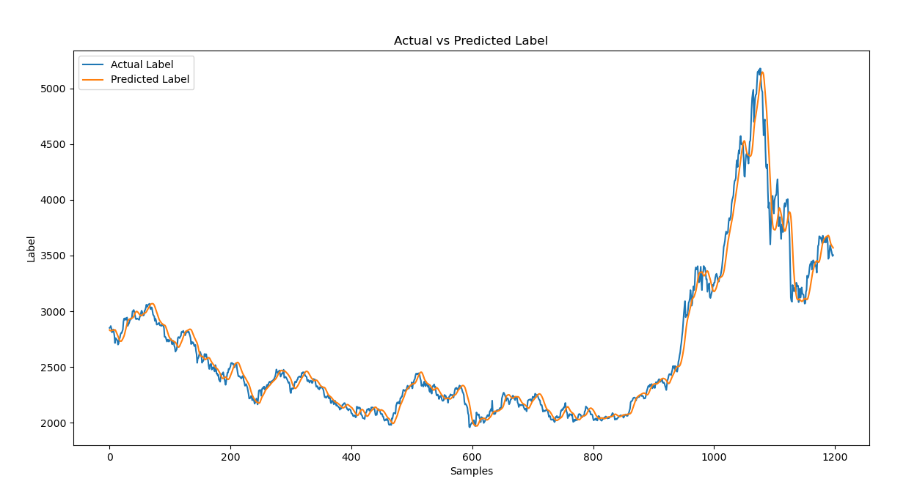

<style></style>

4.2 LSTM + SGD
--------------

### 4.2.1 数据加载

数据加载和基本信息查看：首先使用Pandas库加载名为stock_dataset_2.csv的股票数据文件，并将其存储在DataFrame df中。数据文件包含了日期、开盘价、收盘价等字段。

数据转换与索引设置：将日期列转换为datetime格式，并将其设置为DataFrame的索引，以便后续时间序列分析和模型训练使用。

数据信息和统计描述：通过info()和describe()方法，查看数据的基本信息（数据类型、缺失情况等）和统计描述（均值、标准差等）。

```python
# 读取CSV文件
file_path = 'stock_dataset_2.csv' 
df = pd.read_csv(file_path)
# 将日期列转换为datetime格式
df['date'] = pd.to_datetime(df['date'])df.set_index('date', inplace=True)
```

### 4.2.2 数据归一化

数据标准化：使用MinMaxScaler将所有特征和目标列归一化到[0, 1]范围内，这是神经网络模型训练的常用做法，有助于提高模型的收敛速度和稳定性。

```python
# 缩放数据
scaler_features = MinMaxScaler(feature_range=(0, 1))
scaler_label = MinMaxScaler(feature_range=(0, 1))

scaled_features = scaler_features.fit_transform(df[features])
scaled_label = scaler_label.fit_transform(df[[target]])

scaled_data = np.hstack((scaled_features, scaled_label))
```


准备训练数据：将数据集按照8:2划分训练集和测试集

```python
# 准备训练数据
def create_dataset(data, time_step=1): 
    X, Y = [], [] 
    for i in range(len(data) - time_step - 1):
         X.append(data[i:(i + time_step), :-1]) # 排除最后一列 
         Y.append(data[i + time_step, -1]) # 最后一列作为标签 
    return np.array(X), np.array(Y)
X, Y = create_dataset(scaled_data, time_step)
# 将数据集分为训练集和测试集
train_size = int(len(X) * 0.8)
X_train, X_test = X[:train_size], X[train_size:]
Y_train, Y_test = Y[:train_size], Y[train_size:]  
```

### 4.2.3 模型构建

LSTM模型构建：使用Keras的Sequential API构建了一个包含两层LSTM的模型，以及两个全连接层。LSTM层用于处理时间序列数据，全连接层用于输出预测结果。

模型编译：选择了随机梯度下降（SGD）作为优化器，并使用均方误差作为损失函数来训练模型。

```python
# 构建LSTM模型
model = Sequential()
model.add(LSTM(50，return_sequences=True, input_shape=(time_step, X.shape[2])))
model.add(LSTM(50, return_sequences=False))
model.add(Dense(25))
model.add(Dense(1))

# 编译模型
model.compile(optimizer='sgd', loss='mean_squared_error')
```

### 4.2.4 模型训练

回调函数配置：使用ModelCheckpoint保存验证损失最低的模型权重，EarlyStopping在验证损失不再改善时提前停止训练，以防止过拟合。

模型训练：使用fit()方法训练模型，指定批次大小、训练轮数（epochs）、验证集数据和回调函数。

```python
# 配置回调函数，包括早停和模型检查点
checkpoint = CustomModelCheckpoint(monitor='val_loss', verbose=1, save_best_only=True, mode='min')
early_stopping = EarlyStopping(monitor='val_loss', patience=10, restore_best_weights=True)

# 训练模型并使用回调函数
model.fit(X_train, Y_train, batch_size=32, epochs=epochs, validation_data=(X_test, Y_test), verbose=1, callbacks=[checkpoint, early_stopping])
```

### 4.2.5 模型评估

模型评估：计算均方误差（MSE）、均方根误差（RMSE）

反归一化：将归一化后的预测结果反向转换为原始数据的范围，以便比较和分析模型的实际预测能力。结果可视化：将实际的lable值和预测得到的lable值绘制在同一张图上，对比预测结果是否准确

```python
# 进行预测
Y_pred = model.predict(X_test)

# 反归一化预测结果
Y_test_rescaled = scaler_label.inverse_transform(Y_test.reshape(-1, 1)).flatten()
Y_pred_rescaled = scaler_label.inverse_transform(Y_pred).flatten()

# 计算归一化和反归一化的均方根误差
mse_norm = mean_squared_error(Y_test, Y_pred)
rmse_norm = np.sqrt(mse_norm)
mse_orig = mean_squared_error(Y_test_rescaled, Y_pred_rescaled)
rmse_orig = np.sqrt(mse_orig)
```


### 4.2.6 实验结果

红线为预测结果，蓝线为实际值，可以看出已经能较好的模拟出股票的实际走向，归一化后计算均方根误差达到了0.0174


